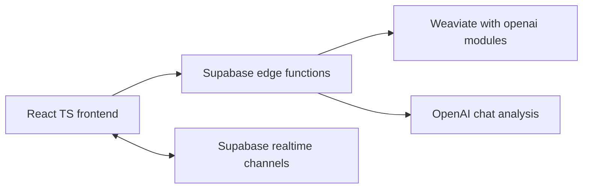

# Observable C2 — Maritime HITL Dashboard with Explainable RAG and Realtime

## Overview

A trace-first, Human-in-the-Loop (HITL) dashboard for maritime anomaly monitoring. The core UX shows the agent’s reasoning steps (RAG → GEN → HITL), an actionable proposal, and an interactive trajectory map.

Why it matters: Defense operations need transparent, auditable AI. This demo makes LLM reasoning observable and operationally useful.

## Dataset

- Source: “Labelled AIS Trajectories Near Svalbard for Abnormal Behaviour Detection” (DTU; CC BY 4.0). DOI 10.11583/DTU.28553462
- Composition: 35 055 trajectories total; 16 labelled anomalous. Signals resampled to 2-minute intervals; long gaps split; very short tracks removed.
- Labels: Vessel types and anomaly labels. Anomaly labels reflect research interpretation during the Jan 2022 Svalbard submarine cable incident; they are not assertions of intent or wrongdoing.
- Artifacts included in this repo:
  - Datasheet: [Datasheet_for_dataset.pdf](Datasheet_for_dataset.pdf)
  - Ship catalog: [df_ships.json](df_ships.json)
- One-liner: df_ships.json maps MMSI → General Type; the demo’s shipType shown in the UI follows this catalog mapping, and the seed data emulates it.

## Quickstart (5–10 minutes)

### Prerequisites
- Docker Desktop
- Node.js 18+
- Supabase CLI
- OpenAI API key with access to chat completions; plus OpenAI key for Weaviate modules

### 1) Start Weaviate with OpenAI modules

In one terminal:

```bash
cd weaviatedb
# macOS/Linux
export OPENAI_API_KEY=your_key_here
# Windows PowerShell
# $env:OPENAI_API_KEY="your_key_here"

docker compose up -d weaviate
```

Wait for readiness:

```bash
curl http://localhost:8080/v1/.well-known/ready
```

### 2) Seed three anomalous trajectories (OpenAI modules)

In another terminal:

```bash
cd weaviatedb/arctic-trace-watch
npm i
WEAVIATE_URL=http://localhost:8080 OPENAI_API_KEY=$OPENAI_API_KEY npm run seed:weaviate
```

This runs [scripts/seed_openai.mjs](weaviatedb/arctic-trace-watch/scripts/seed_openai.mjs) to:
- Ensure class SEAuAISAnomaly
- Insert sample anomalies
- List them and optionally run grouped generate if OPENAI_API_KEY is present

### 3) Start Supabase locally (functions + realtime)

```bash
cd weaviatedb/arctic-trace-watch
supabase start
```

Copy the API URL and anon key from the output.

In a new terminal, serve the Edge Functions (CORS is permissive in source):

```bash
supabase functions serve --no-verify-jwt
```

### 4) Configure frontend environment

Create [weaviatedb/arctic-trace-watch/.env.local](weaviatedb/arctic-trace-watch/.env.local) with:

```ini
VITE_SUPABASE_URL=http://127.0.0.1:54321
VITE_SUPABASE_PUBLISHABLE_KEY=<anon key from supabase start>
```

### 5) Run the frontend

```bash
cd weaviatedb/arctic-trace-watch
npm run dev
```

Open http://localhost:5173

## What the judges will see

- Type “threats near Svalbard” → Execute.
- XAI trace updates: RAG → GEN → HITL.
- Proposal appears (concise, actionable).
- The map shows trajectories with start/centroid/end and optional replay.
- Approve → HITL decision is logged.
- Optional: toggle Go Live → Supabase Realtime ticks animate map across two browser windows.

## Architecture

- Frontend: React + TypeScript (Vite, shadcn/ui)
- Edge Functions: Supabase (Deno TS), using fetch to call Weaviate/OpenAI
- Vector DB: Weaviate with text2vec-openai + generative-openai
- Realtime: Supabase channel broadcast



## API surface

- POST /agent-query via [serve()](weaviatedb/arctic-trace-watch/supabase/functions/agent-query/index.ts:9)
  - Body: { prompt: string; limit?: number }
  - Returns: { proposal: string; data: Trajectory[]; trace: string[]; traceId: string; timings: { totalMs: number; weaviateMs?: number } }
  - Proposal helper: [generateProposal()](weaviatedb/arctic-trace-watch/supabase/functions/agent-query/index.ts:142)
- POST /agent-approve via [serve()](weaviatedb/arctic-trace-watch/supabase/functions/agent-approve/index.ts:8)
  - Body: { prompt: string; proposal: string; approved: boolean; rationale?: string; traceId?: string }
  - Returns: { ok: true }
- POST /analyze-threat via [serve()](weaviatedb/arctic-trace-watch/supabase/functions/analyze-threat/index.ts:11)
  - Body: { trajectories: Trajectory[]; userPrompt: string }
  - Returns: { analysis: string } (requires OPENAI_API_KEY in the function env)
- Health check via [serve()](weaviatedb/arctic-trace-watch/supabase/functions/health-check/index.ts:8)

## Realtime channels

- oc2:telemetry (broadcast) event tick → payload: { traceId, ts, vessels: [{ mmsi, lat, lon, speed?, course? }], done? }
- oc2:trace (broadcast) event trace → payload: { traceId, step, timestamp }
- Client manager: [RealtimeManager](weaviatedb/arctic-trace-watch/src/services/realtime.ts:27)

## Environment variables

- Weaviate container (Compose): OPENAI_APIKEY is passed from host OPENAI_API_KEY
- Seed script: WEAVIATE_URL=http://localhost:8080, OPENAI_API_KEY
- Supabase functions: OPENAI_API_KEY (for analyze-threat)
- Frontend: VITE_SUPABASE_URL, VITE_SUPABASE_PUBLISHABLE_KEY

## Troubleshooting

- Weaviate not ready: curl http://localhost:8080/v1/.well-known/ready
- No proposal or grouped generate: ensure OPENAI_API_KEY exported and Compose ENABLE_MODULES includes text2vec-openai,generative-openai
- Supabase 403 or function errors: confirm .env.local VITE_SUPABASE_URL and VITE_SUPABASE_PUBLISHABLE_KEY
- Realtime no ticks: ensure supabase start is running and open two browser windows with Go Live enabled

## Developer notes

- Lovable project link retained for convenience; main demo instructions above are standalone.
- Optional reference scripts not used in this OpenAI quickstart:
  - [scripts/seed_and_list.ts](scripts/seed_and_list.ts)
  - [scripts/seed_and_list_graphql.mjs](scripts/seed_and_list_graphql.mjs)

## Licenses and attribution

- Code: MIT (unless otherwise noted)
- Data: DTU “Labelled AIS Trajectories Near Svalbard for Abnormal Behaviour Detection” — CC BY 4.0. Cite DOI 10.11583/DTU.28553462
